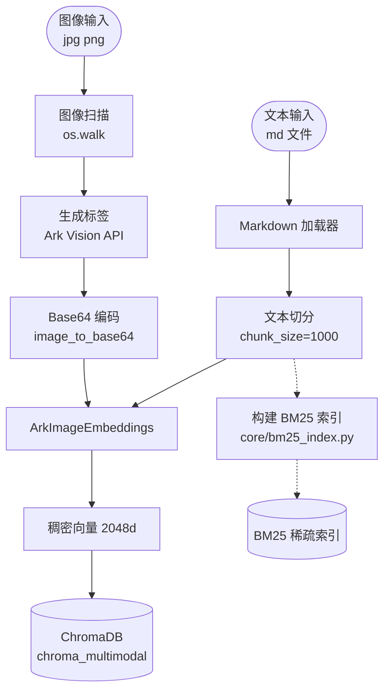
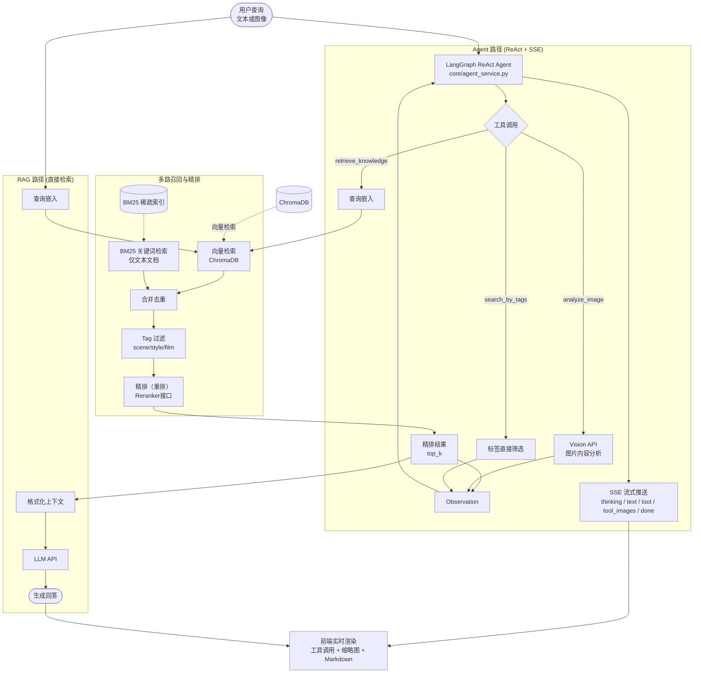

# AI Agent驱动的胶片摄影归档系统

## 🚀Features

- **多模态知识库**：支持将照片和文本文档（如摄影技法指南）存储到向量数据库中
- **自动标签生成**：为照片自动生成拍摄场景、拍摄风格和胶片特征标签
- **基于向量和标签的混合检索**：支持按场景标签、风格标签和胶片特征标签过滤检索结果
- **通过自然语言交互**：通过自然语言向Agent描述需求，Agent会根据需要通过Tool Using方式检索知识库


## 🔧系统架构

### 核心组件

1. **资源层**
   - 图片资源：存储在`resources/img/`目录下，支持多级子目录组织
   - 文档资源：存储在`resources/doc/`目录下，支持Markdown格式文档

2. **向量处理层**
   - `core/vector_db.py`：向量数据库核心功能，封装Chroma与Ark多模态嵌入
   - `core/bm25_index.py`：BM25关键词检索索引，支持稀疏向量多路召回
   - `core/reranker.py`：多策略结果精排（alibaba/local/none）

3. **检索与生成层**
   - `core/agent_service.py`：LangChain ReAct Agent，通过Tool Using检索知识库并流式输出
   - `core/chat_service.py`：RAG对话服务（非Agent路径）

4. **工具层**
   - `core/services.py`：提供图片转base64、照片标签生成等工具函数
   - `configures.py`：系统配置和提示词管理

5. **应用层**
   - `api/views.py` / `api/sse.py`：Django RESTful API与SSE流式响应
   - Web前端：React（Vite构建）

### 数据流示意
#### Offline 数据准备



#### Online 检索生成




### 代码结构

```
AgenticFilmArchive/
├── film_archive/         # Django项目配置
│   ├── settings.py
│   ├── urls.py
│   └── wsgi.py
├── api/                  # RESTful API层
│   ├── views.py
│   ├── serializers.py
│   ├── sse.py            # SSE流式传输
│   └── urls.py
├── core/                 # 核心业务逻辑
│   ├── agent_service.py  # ReAct Agent服务
│   ├── vector_db.py      # 向量数据库服务
│   ├── chat_service.py   # AI对话服务
│   ├── bm25_index.py     # BM25关键词检索
│   ├── reranker.py       # 多策略精排
│   ├── services.py       # 图片处理与标签生成
│   └── views.py          # 前端入口视图
├── frontend/             # React前端应用（Vite构建）
│   ├── src/
│   │   ├── components/   # 可复用组件
│   │   ├── pages/        # 页面组件
│   │   ├── services/     # API客户端
│   │   └── utils/        # 工具函数
│   ├── package.json
│   └── vite.config.js
├── static/               # 构建产物静态资源（Django serve）
├── templates/            # HTML模板
├── test/                 # 测试用例
│   ├── test_bm25.py
│   └── test_reranker.py
├── resources/            # 知识库资源
│   ├── img/              # 图片资源
│   └── doc/              # 文档资源
├── pyproject.toml        # uv项目配置
├── uv.lock               # uv依赖锁定文件
├── manage.py             # Django管理脚本
└── .env                  # 环境配置变量
```

## 📦 安装

### 前置需求
- Python 3.12+（使用uv环境）
- Node.js 18+
- 火山引擎API

### 快速开始

#### 1. 克隆项目代码
```bash
git clone https://github.com/Rollbear-bot/AgenticFilmArchive.git
cd AgenticFilmArchive
```

#### 2. 配置环境变量
```bash
cp .env.example .env
# 编辑.env文件，配置Ark API密钥及相关参数
# ARK_API_KEY=your_ark_api_key_here
# BM25_ENABLED="true"          # 是否启用BM25关键词多路召回
# RERANK_STRATEGY="alibaba"    # 精排策略：alibaba / local / none
```

#### 3. 安装依赖
```bash
# 使用uv安装Python依赖
uv sync
```

#### 4. 准备知识库资源
```bash
# 创建资源目录结构
mkdir -p resources/img resources/doc

# 将照片放入resources/img/
# 将相关文本文档放入resources/doc/
```

#### 5. 构建前端
```bash
cd frontend
npm install
npm run build
cd ..
```

#### 6. 启动服务器
```bash
# Django后端（端口8000，同时serve前端静态文件）
python manage.py runserver
```

#### 7. 初始化向量数据库
访问 http://localhost:8000/sync/ ，点击"开始同步"将资源导入向量数据库。


## ⚠️注意事项

1. 系统依赖Volcengine Ark（火山引擎）API，需要有效的API Key（[获取方法](https://www.volcengine.com/docs/82379/1399008?lang=zh)）
2. 您的文件会通过Ark API上传到火山引擎，请阅读火山引擎的隐私政策
3. 首次运行时，系统会扫描`resources`目录并构建向量数据库，首次初始化可能需要较长时间
4. 支持的图片格式：jpg、jpeg、png
5. 支持的文档格式：Markdown

## 📝TODO

- [x] 召回后精排rerank
- [x] BM25关键词匹配 + 多路召回
- [x] 多查询召回
- [ ] 语义切分chunking
- [ ] 多层Agent Memory
- [ ] 智能相册自动分类
